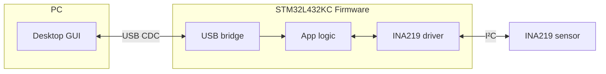

# stm32-power-scope

A **USB-connected power monitor** built with **STM32L4 + INA219**.  
Streams voltage, current, and power over USB CDC to a desktop GUI for live plotting and register control.  

---
## 🧩 Architecture



* **USB CDC** → driver-free, cross-platform PC link.
* **STM32L432KC** → native USB FS + low-power capable.
* **INA219** → I²C sensor with current shunt + voltage measurement.
* **Firmware layering** → clear separation of drivers, comm, and application logic.


## 🚀 Quick Start

**Current status:** USB-CDC echo and **framed streaming** (16-byte header with `seq` and `ts_ms`), ring-buffered with DTR-gated TX. A minimal Python shell reads frames and can send **START/STOP**.

**Firmware**

1. Open the project in STM32CubeIDE and **build/flash** the STM32L432KC.
2. Connect USB (D+→PA12, D−→PA11). The device enumerates as a **Virtual COM Port**.

**Host (Python shell)**

```bash
python -m pip install -r host/requirements.txt
python -m host.cli.shell                # auto-detects the port and asserts DTR
# Or specify a port:
#   Windows: python -m host.cli.shell -p COM6
#   Linux:   python -m host.cli.shell -p /dev/ttyACM0
#   macOS:   python -m host.cli.shell -p /dev/tty.usbmodem*
# Optional on open: --start  (send START)   --stop  (send STOP)
```

**Expected output:** one line per frame (`seq`, `ts_ms`, `len`, `gap`).
`gap > 1` indicates at least `gap−1` frames were missed (oldest dropped). Closing the port de-asserts DTR → stream pauses; reopening resumes.

---

## 📊 Roadmap

### Firmware
* [x] USB CDC bring-up + smoke test (echo)
* [x] Add ring buffer for TX/RX decoupling
* [x] Minimal binary protocol (framing; seq/timestamp)
* [x] CDC streaming path (DTR-gated pump)
* [ ] INA219 driver integration
* [ ] Stream voltage/current/power
* [ ] Add CRC to frames
* [ ] Optional RTOS support (tasks, queues)

### Host
* [x] CLI shell (auto-detect, START/STOP, framed reads)
* [ ] Cross-platform GUI with live plots & register controls

---

## 📖 Documentation

See [docs/usb\_cdc\_setup.md](docs/usb_cdc_setup.md) for detailed bring-up steps.

---

## References

- [STM32L432KC Datasheet (STMicroelectronics)](https://www.st.com/resource/en/datasheet/stm32l432kc.pdf)  
- [STM32 Nucleo-32 User Manual (UM1956)](https://www.st.com/resource/en/user_manual/um1956-stm32-nucleo32-boards-mb1180-stmicroelectronics.pdf)  
- [INA219 Datasheet (Texas Instruments)](https://www.ti.com/lit/ds/symlink/ina219.pdf)  
- [STM32Cube™ USB Device Library (UM1734)](https://www.st.com/resource/en/user_manual/um1734-stm32cube-usb-device-library-stmicroelectronics.pdf)  

## 📜 License

This project is MIT-licensed. See [LICENSE](LICENSE).
