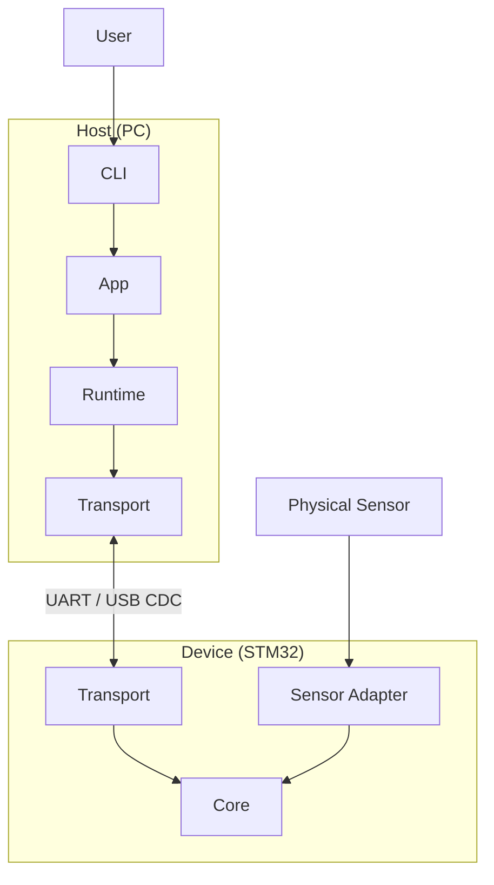

# STM32 Power Scope

[](https://github.com/brahimab8/stm32-power-scope/actions/workflows/ci.yml)
[](https://codecov.io/gh/brahimab8/stm32-power-scope)

Embedded sensor streaming framework for microcontrollers.
A transport- and sensor-agnostic firmware/host architecture for real-time data streaming.

---
## 📊 Features

- **End-to-end embedded sensor streaming system**  
  Reference STM32 firmware (STM32L432) built on a reusable, hardware-agnostic C streaming core.

- **Transport-agnostic binary protocol**  
  Framed, CRC-protected protocol supporting commands, acknowledgments, and real-time streaming over UART or USB CDC.

- **Reusable C core library with multi-sensor support**  
  Hardware-independent streaming engine supporting multiple concurrently configured sensors, with a thin `board_*` hardware abstraction layer (timebase, I²C, UART/USB transport) for MCU-specific integration.

- **Metadata-driven host application (Python)**  
  CLI and runtime fully driven by YAML metadata (protocol, transports, sensors) — no code changes required for extensions.

- **Tested and reproducible**  
  Host-built unit tests for the C core, Python tests for the host, CI coverage, and reproducible session recordings.

---
## 🧩 System Overview

A user-operated Python host application communicates with an STM32-based device
over a shared binary protocol (UART or USB CDC) to control sensors and stream data.


Internal structure and behavior are documented in `docs/architecture.md`.


## 📁 Repository Layout

- `powerscope/` – hardware-agnostic C streaming core (reusable across MCUs)
- `firmware/`   – STM32 reference firmware (STM32L432, CubeIDE-compatible)
- `host/`       – Python host application (CLI, runtime, metadata)
- `docs/`       – architecture and protocol documentation
- `scripts/`    – Windows PowerShell build/flash helpers
- `third_party/`– external dependencies (Unity)
- `CMakeLists.txt` – primary build configuration
- `Makefile` – Linux/CI wrapper around CMake targets
- `.github/workflows/` – CI configuration

---

## 🚀 Quick Start

### Requirements (hardware)

- Supported **STM32 board** (reference implementation: **STM32L432**)
- **ST-LINK** (on-board or external)
- Physical connection:
  - **UART** via ST-LINK VCP (**default**), or
  - **USB** (for USB CDC)

*The `firmware/` directory contains a complete STM32L432 firmware project (also usable directly in STM32CubeIDE).  

---

### 1. Clone the repository

```bash
git clone https://github.com/brahimab8/stm32-power-scope.git
cd stm32-power-scope
```

### 2. Build and flash the firmware

The firmware build is configurable via the following parameters:

* **PS_TARGET** – firmware target under `firmware/`
  *(default: `stm32l432_nucleo`)*

* **PS_TRANSPORT** – communication transport
  `UART` or `USB_CDC` *(default: `UART`)*

---

### Windows (PowerShell — recommended)

#### 1. (Optional, one-time) Install recommended build tools

This helper installs common ARM firmware build dependencies using **winget** and **MSYS2**.

```powershell
.\scripts\install-tools.ps1
```

---

#### 2. Set up the build environment (per terminal)

This script:

* Ensures CMake and Ninja are available
* Locates the Arm GNU toolchain (`arm-none-eabi-*`)
* Attempts to locate OpenOCD (required only for flashing/debug)

```powershell
.\scripts\env.ps1
```

---

#### 3. Build the firmware

Builds the firmware using the selected target and transport (defaults shown above).
Firmware artifacts are generated under build-fw/<PS_TARGET>/<PS_TRANSPORT>/<CONFIG>/.

```powershell
.\scripts\build-fw.ps1
```

Example (explicit target and USB CDC transport):

```powershell
.\scripts\build-fw.ps1 -Target stm32l432_nucleo -Transport USB_CDC
```

---

#### 4. Build and flash the firmware (optional)

Requires OpenOCD in `PATH` and a firmware target that provides a `flash` CMake target.

```powershell
.\scripts\build-fw.ps1 -Flash
```

---

### Linux / macOS

Ensure the following tools are installed:

- Arm GNU Toolchain (`arm-none-eabi-*`)
- CMake (≥ 3.20)
- Ninja
- A CMake toolchain file for cross-compiling (e.g. `cmake/arm-none-eabi-toolchain.cmake`)
- OpenOCD (optional, for flash/debug)

Build the firmware (default target and transport):

```bash
make fw-build TOOLCHAIN=cmake/arm-none-eabi-toolchain.cmake
```

Example (explicit target and USB CDC transport):

```bash
make fw-build PS_TARGET=stm32l432_nucleo PS_TRANSPORT=USB_CDC TOOLCHAIN=cmake/arm-none-eabi-toolchain.cmake
```

Flash the firmware (optional, requires OpenOCD):

```bash
make fw-flash TOOLCHAIN=cmake/arm-none-eabi-toolchain.cmake
```


---

### 3. Install and run the host CLI

Install the host application:

```bash
pip install -e .
```

Check device status:

```bash
python -m host.cli status --transport uart --port <PORT>
```

Stream data (all discovered sensors):

```bash
python -m host.cli stream --transport uart --port <PORT> --secs 10 --period-ms 2000 --record
```

*Recording creates a reproducible session folder containing `session.json`, command traces, and per-sensor CSV streams.*


## 🧪 Testing

### Core library (C, native-built)

Unit tests for the hardware-agnostic core library are built and run on the host
and are executed in CI.

These tests use the Unity framework and are registered and executed via CTest.
If you did not clone the repository recursively, initialize the submodule first:

```bash
git submodule update --init
```

Then build and run the tests:

```bash
make build
make test
make coverage
```
*`make test` runs the registered unit tests via `ctest`.  
Coverage reports are generated locally and in CI.*

### Host (Python)
Install development dependencies:

```bash
pip install -e ".[dev]"
```

Run the host-side unit-tests:
```bash
pytest
```

---
## 📖 Documentation

- [Architecture](docs/architecture.md) : diagrams and design notes
- [Protocol specification](docs/protocol.md) – binary framing and command definitions
- [USB-CDC bring-up guide](docs/usb_cdc_setup.md) : detailed setup steps

---

## 📚 References

- [STM32L432KC Datasheet (STMicroelectronics)](https://www.st.com/resource/en/datasheet/stm32l432kc.pdf)  
- [STM32 Nucleo-32 User Manual (UM1956)](https://www.st.com/resource/en/user_manual/um1956-stm32-nucleo32-boards-mb1180-stmicroelectronics.pdf)  
- [INA219 Datasheet (Texas Instruments)](https://www.ti.com/lit/ds/symlink/ina219.pdf)  
- [STM32Cube™ USB Device Library (UM1734)](https://www.st.com/resource/en/user_manual/um1734-stm32cube-usb-device-library-stmicroelectronics.pdf)  

## 📜 License
This project is MIT-licensed. See [LICENSE](LICENSE).