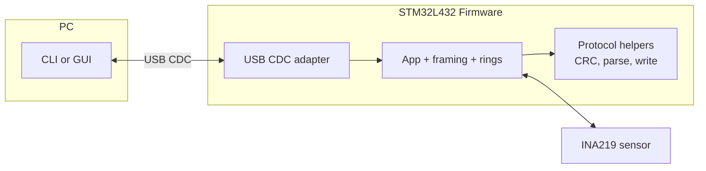

# stm32-power-scope

USB-connected power monitor built with *STM32L4* and *INA219* sensor.
Provides a simple way to measure current, voltage, and power and visualize or log the results on a PC.

---
## 📊 Features & Roadmap

### Firmware (*C*)

* [x] **USB-CDC device** (driverless, cross-platform)
* [x] **Ring buffers:** TX **frame-aware drop-oldest**, RX **no-overwrite** (drop-newest)
* [ ] **INA219 driver integration** (real voltage/current/power)
* [ ] **RTOS port** with tasks/queues

### Protocol (*binary, transport-agnostic*)

* [x] **Framed communication** (header + payload + CRC-16)
* [x] **Sequence ID** and **timestamp** (drop/jitter detection)
* [x] **START/STOP commands**
* [x] **Fits one 64-byte CDC write** (max payload 46 bytes)
* [ ] **Extended command set** (future)

### Host (*Python*)

* [x] **CLI** for testing and logging
* [ ] **GUI** for live plotting (I/V + derived P)

---
## 🧩 Architecture



* **USB CDC** → driver-free, cross-platform PC link.
* **STM32L432KC** → native USB FS + low-power capable.
* **INA219** → I²C sensor with current shunt + voltage measurement.
* **Firmware layering** → clear separation of drivers, comm, and application logic.


## 🚀 Quick Start

- Firmware: USB-CDC bring-up, ring-buffered framed streaming (seq + timestamp).  
- Host: minimal Python CLI (send START/STOP, read frames).  

**Firmware**

1. Open the project in STM32CubeIDE and **build/flash** the STM32L432KC.
2. Connect USB (D+→PA12, D−→PA11). The device enumerates as a **Virtual COM Port**.

**Host (Python shell)**

```bash
python -m pip install -r host/requirements.txt
python -m host.cli.shell                # auto-detects the port and asserts DTR
# Or specify a port:
#   Windows: python -m host.cli.shell -p COM6
#   Linux:   python -m host.cli.shell -p /dev/ttyACM0
#   macOS:   python -m host.cli.shell -p /dev/tty.usbmodem*
# Optional on open: --start  (send START)   --stop  (send STOP)
```

**Expected output:** one line per frame (`seq`, `ts_ms`, `len`, `gap`).
`gap > 1` indicates at least `gap−1` frames were missed (oldest dropped). Closing the port de-asserts DTR → stream pauses; reopening resumes.

---

## 📖 Documentation

- [Architecture](docs/architecture.md) – diagrams and design notes
- [USB-CDC bring-up guide](docs/usb_cdc_setup.md) – detailed setup steps
<!-- - [INA219 setup guide](docs/ina219_setup.md) – wiring and register configuration -->

---

## 📚 References

- [STM32L432KC Datasheet (STMicroelectronics)](https://www.st.com/resource/en/datasheet/stm32l432kc.pdf)  
- [STM32 Nucleo-32 User Manual (UM1956)](https://www.st.com/resource/en/user_manual/um1956-stm32-nucleo32-boards-mb1180-stmicroelectronics.pdf)  
- [INA219 Datasheet (Texas Instruments)](https://www.ti.com/lit/ds/symlink/ina219.pdf)  
- [STM32Cube™ USB Device Library (UM1734)](https://www.st.com/resource/en/user_manual/um1734-stm32cube-usb-device-library-stmicroelectronics.pdf)  

## 📜 License

This project is MIT-licensed. See [LICENSE](LICENSE).
