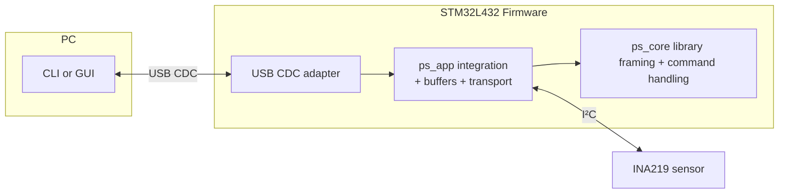

# STM32 Power Scope

[](https://github.com/brahimab8/stm32-power-scope/actions/workflows/ci.yml)
[](https://codecov.io/gh/brahimab8/stm32-power-scope)

USB-connected power monitor built with *STM32L4* and *INA219* sensor.
Provides a simple way to measure current, voltage, and power and visualize or log the results on a PC.

---
## 📊 Features & Roadmap

### Firmware (*C*)

* [x] **USB-CDC device** (driverless, cross-platform)
* [x] **Ring buffers:** TX **frame-aware drop-oldest**, RX **no-overwrite** (drop-newest)
* [x] **INA219 driver integration** (real voltage/current/power)
* [x] **Unit tests** (via Unity, run via Make/CMake)
* [ ] **RTOS port** with tasks/queues

### Protocol (*binary, transport-agnostic*)

* [x] **Framed communication** (header + payload + CRC-16)
* [x] **Sequence ID** and **timestamp** (drop/jitter detection)
* [x] **START/STOP commands**
* [x] **Fits one 64-byte CDC write** (max payload 46 bytes)
* [ ] **Extended command set** (future)

### Host (*Python*)

* [x] **CLI** for testing and logging
* [ ] **GUI** for live plotting (I/V + derived P)

---
## 🧩 Architecture



* **USB CDC** → driver-free, cross-platform PC link.
* **STM32L432KC** → native USB FS + low-power capable.
* **INA219** → I²C sensor with current shunt + voltage measurement.
* **Firmware layering** → clear separation of drivers, comm, and application logic.

## 📁 Repository Layout

- `powerscope/` – hardware-agnostic, board-independent library
  - `include/` – public headers
  - `src/` – library source files
  - `tests/` – unit tests for library
  - `CMakeLists.txt` – library-specific build
- `firmware/` – STM32 board-specific integration and glue
  - `Core/` – main STM32 source and header files
  - `Drivers/` – STM32 HAL or peripheral drivers
- `host/` – Python CLI/GUI for reading frames and logging
- `third_party/` – external dependencies (e.g., Unity for unit tests)
- `docs/` – architecture and setup documentation
- `Makefile` / `CMakeLists.txt` – top-level build scripts for library and host

## 🚀 Quick Start

- Firmware: USB-CDC bring-up, ring-buffered framed streaming (seq + timestamp).  
- Host: minimal Python CLI (send START/STOP, read frames).  

**Firmware**

1. Open the project in STM32CubeIDE and **build/flash** the STM32L432KC.
2. Connect USB (D+→PA12, D−→PA11). The device enumerates as a **Virtual COM Port**.

**Host (Python shell)**

```bash
python -m pip install -r host/requirements.txt
python -m host.cli.shell [-p PORT] [--start] [--stop] [--log]
```

* `--start` / `--stop` – send START/STOP command once when the port opens.
* `--log` – log frames to a CSV file (stored under `host/logs/…`) and automatically send START.
* If `--log` is used, the CLI will send STOP automatically when it exits.
* The CLI prints one line per streamed frame with current, voltage, and power. Detailed options are available via `--help`
**Expected output** – one line per STREAM frame, for example:

```
seq=      42 ts=   825 I=   9600uA V= 3152mV P=    30mW gap=  1
```

* `seq` – 32-bit sequence number.
* `ts`  – device timestamp in milliseconds.
* `I`   – current in microamperes (µA).
* `V`   – bus voltage in millivolts (mV).
* `P`   – power in milliwatts (mW), computed on the host from I and V.
* `gap` – difference from the previous sequence number; `gap > 1` means frames were dropped (oldest first).

Closing the port de-asserts DTR, which pauses streaming; reopening resumes it.

**Frame payload format:**  
Each streamed frame now contains real INA219 measurements in little-endian order:
- `uint16`  Bus voltage in millivolts (mV)
- `int32`   Current in microamperes (µA)

---

## 🧪 Testing & Coverage

Run unit tests and generate coverage reports for the library (excluding `ps_app.c`):

```bash
# Build library and tests
make build

# Run unit tests
make test

# Generate coverage report
make coverage
```

---
## 📖 Documentation

- [Architecture](docs/architecture.md) – diagrams and design notes
- [USB-CDC bring-up guide](docs/usb_cdc_setup.md) – detailed setup steps
<!-- - [INA219 setup guide](docs/ina219_setup.md) – wiring and register configuration -->

---

## 📚 References

- [STM32L432KC Datasheet (STMicroelectronics)](https://www.st.com/resource/en/datasheet/stm32l432kc.pdf)  
- [STM32 Nucleo-32 User Manual (UM1956)](https://www.st.com/resource/en/user_manual/um1956-stm32-nucleo32-boards-mb1180-stmicroelectronics.pdf)  
- [INA219 Datasheet (Texas Instruments)](https://www.ti.com/lit/ds/symlink/ina219.pdf)  
- [STM32Cube™ USB Device Library (UM1734)](https://www.st.com/resource/en/user_manual/um1734-stm32cube-usb-device-library-stmicroelectronics.pdf)  

<!-- ## 📦 Third-party assets
This project uses [Bootstrap Icons](https://icons.getbootstrap.com/)  
licensed under the [MIT License](https://github.com/twbs/icons/blob/main/LICENSE.md). -->

## 📜 License
This project is MIT-licensed. See [LICENSE](LICENSE).


