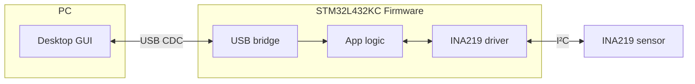

# stm32-power-scope

A **USB-connected power monitor** built with **STM32L4 + INA219**.  
Streams voltage, current, and power over USB CDC to a desktop GUI for live plotting and register control.  

---
## 🧩 Architecture

* **USB CDC** → driver-free, cross-platform PC link.
* **STM32L432KC** → native USB FS + low-power capable.
* **INA219** → I²C sensor with current shunt + voltage measurement.
* **Firmware layering** → clear separation of drivers, comm, and application logic.

## 🚀 Quick Start

⚠️ **TODO**: Prebuilt firmware + GUI will be provided here.
For now, see [docs/usb\_cdc\_setup.md](docs/usb_cdc_setup.md) for bring-up instructions.

---

## 📊 Roadmap

### Firmware
* [x] USB CDC bring-up + smoke test (echo)
* [ ] INA219 driver integration
* [ ] Stream voltage/current/power
* [ ] Add ring buffer for TX/RX decoupling
* [ ] Lightweight binary protocol with CRC
* [ ] Optional RTOS support (tasks, queues)

### Host GUI
* [ ] Cross-platform GUI
* [ ] Live plots (voltage/current/power)
* [ ] Register read/write controls

---

## 📖 Documentation

See [docs/usb\_cdc\_setup.md](docs/usb_cdc_setup.md) for detailed bring-up and smoke test steps.

---

## References

- [STM32L432KC Datasheet (STMicroelectronics)](https://www.st.com/resource/en/datasheet/stm32l432kc.pdf)  
- [STM32 Nucleo-32 User Manual (UM1956)](https://www.st.com/resource/en/user_manual/um1956-stm32-nucleo32-boards-mb1180-stmicroelectronics.pdf)  
- [INA219 Datasheet (Texas Instruments)](https://www.ti.com/lit/ds/symlink/ina219.pdf)  
- [STM32Cube™ USB Device Library (UM1734)](https://www.st.com/resource/en/user_manual/um1734-stm32cube-usb-device-library-stmicroelectronics.pdf)  

## 📜 License

This project is MIT-licensed. See [LICENSE](LICENSE).
