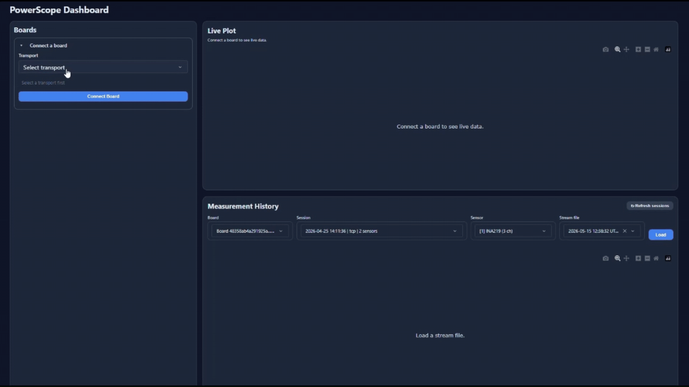

# STM32 Power Scope

[](https://github.com/brahimab8/stm32-power-scope/actions/workflows/ci.yml)
<!-- [](https://codecov.io/gh/brahimab8/stm32-power-scope) -->

Embedded sensor streaming framework for microcontrollers.
PowerScope includes a reusable C core, multi-target firmware, and a Python host stack with a browser-based App and daemon control plane.

## 📊 Features

- Reusable C streaming core (`powerscope/`)
- Firmware with multiple targets, including STM32 and simulator (`firmware/`)
- Python host stack: host runtime/controller, daemon, Web-App (Dash UI), and control CLI (`host/`)

## System Overview

Host and firmware communicate through a shared binary protocol over transport adapters.

```mermaid
flowchart LR
  USER[User]

  subgraph HOST[Host]
    DASH[Web App]
    DAEMON[Daemon]
    CTL[Control CLI]
  end

  USER --> DASH
  USER --> CTL
  DASH --> DAEMON
  CTL --> DAEMON
  DAEMON <--> |UART| DEV_1["Board 1 (STM32)"]
  DAEMON <--> |USB-CDC| DEV_2["Board 2 (STM32)"]
  DAEMON <--> |TCP| DEV_3["Board 3 (Host-Sim)"]

  DEV_1 <--> |I2C| S_1_1[Sensor 1]
  DEV_1 <--> |I2C| S_1_2[Sensor 2]
  ```

For architecture details and diagrams, see `docs/architecture.md`.

## Repository Layout

- `powerscope/`: portable C protocol/streaming core
- `drivers/`: sensor drivers (for example INA219)
- `firmware/`: firmware targets (STM32 reference target and simulator target)
- `host/`: Python host runtime, daemon, clients, metadata
- `docs/`: architecture, protocol, daemon/API, CLIs, Dash UI, testing

## Quick Setup (Windows)

This README keeps a short Windows quick start.
Linux build/flash/test workflows are documented in `docs/linux-workflows.md`.

### 1) Clone and install host package

```powershell
git clone https://github.com/brahimab8/stm32-power-scope.git
cd stm32-power-scope
python -m venv venv
.\venv\Scripts\Activate.ps1
pip install -e ".[dev]"
```

### 2) Run simulator (no hardware needed)

```powershell
.\scripts\run-sim.ps1
```

Optional custom simulator port:

```powershell
.\scripts\run-sim.ps1 -SimPort 9001
```

### 3) Start daemon

```powershell
python -m host.daemon --host 127.0.0.1 --port 8765
```

### 4) Open the Dash UI

```powershell
python -m host.clients.dash --daemon-url http://127.0.0.1:8765 --host 127.0.0.1 --port 8050
```

Open `http://127.0.0.1:8050`.

For a full local demo, `scripts/run-demo.ps1` launches the simulator, daemon, and Dash together.

### 5) Optional: control board with daemon CLI

```powershell
python -m host.clients.ctl --daemon-url http://127.0.0.1:8765 boards connect --board-id sim1 --transport tcp --transport-arg ip 127.0.0.1 --transport-arg port 9000
python -m host.clients.ctl --daemon-url http://127.0.0.1:8765 board sim1 sensors
python -m host.clients.ctl --daemon-url http://127.0.0.1:8765 board sim1 read --sensor 1
```

## Demo

The animated demo below shows the Dash web interface in action:

1. Connect a board over USB (left side).
2. Start a sensor stream and watch the live plotting area update (top-right).
3. Add a second board (simulation) over TCP.
4. Start two sensor streams on that board and plot them together in the live plotting area.
5. Open measurement history and load stored measurements back into the plotting area (bottom-right).



## Documentation

- `docs/architecture.md`: host/firmware architecture and boundaries
- `docs/protocol.md`: wire protocol specification
- `docs/daemon.md`: daemon API and deployment notes
- `docs/dash_app.md`: browser UI for interactive board and sensor control
- `docs/ctl_cli.md`: daemon control CLI command reference
- `docs/testing.md`: test layers and how to run them
- `docs/linux-workflows.md`: Linux workflows for build, flash, and test
- `docs/legacy_cli.md`: old direct CLI (`host.cli`) usage notes
- `docs/firmware-debug.md`: firmware debug/build notes
- `docs/usb_cdc_setup.md`: USB CDC bring-up guide

## 📚 References

- [STM32L432KC Datasheet (STMicroelectronics)](https://www.st.com/resource/en/datasheet/stm32l432kc.pdf)
- [STM32 Nucleo-32 User Manual (UM1956)](https://www.st.com/resource/en/user_manual/um1956-stm32-nucleo32-boards-mb1180-stmicroelectronics.pdf)
- [INA219 Datasheet (Texas Instruments)](https://www.ti.com/lit/ds/symlink/ina219.pdf)
- [STM32Cube USB Device Library (UM1734)](https://www.st.com/resource/en/user_manual/um1734-stm32cube-usb-device-library-stmicroelectronics.pdf)

## 📜 License
This project is MIT-licensed. See [LICENSE](LICENSE).
