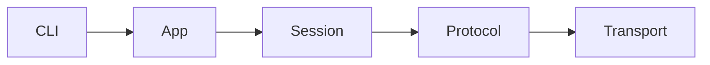
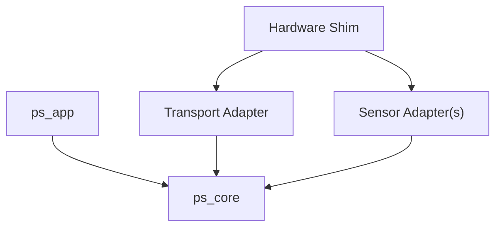
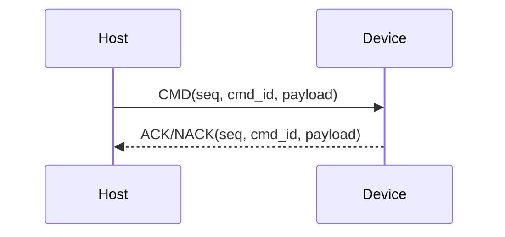
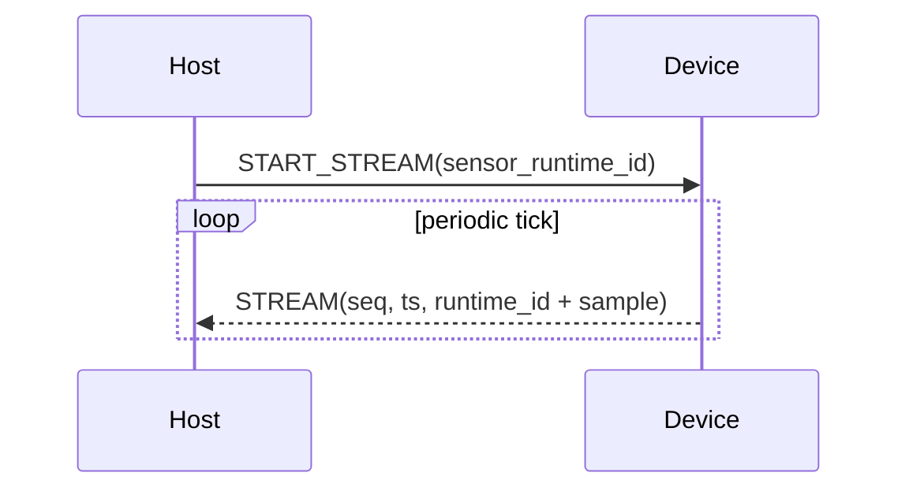

# Architecture

This document is the **authoritative structural view** of Power Scope:
how the host runtime and embedded core are composed, and how they interact.
(High-level overview lives in the README.)

---

## System Context

Power Scope consists of a Python host application and an embedded firmware stack
(portable core + board shim; STM32 is the reference), communicating over a shared
binary protocol (UART or USB CDC) to control sensors and stream measurement data.

## Design Principles

1. Host live state is owned by the **Session** layer.
2. Device core contains **no HAL**; hardware is injected via adapters/shim.
3. Wire behavior is defined by `docs/protocol.md`.
4. The device core prioritizes control responses (ACK/NACK) over streaming; streaming is best-effort.

## Host architecture

The host is **session-centric**: one session instance owns the live device connection,
runtime sensor state, and stream fan-out.

**Responsibilities**

* **CLI**: user entrypoints
* **App**: orchestration (controller/runner), attaches sinks/recorders
* **Session**: device lifecycle + health + discovered sensors, publishes decoded readings
* **Protocol**: framing/parsing, sequencing, ACK/NACK correlation, stream callbacks, decoding
* **Transport**: UART/USB byte I/O (open/read/write/flush)

---

## Embedded firmware architecture

The device is **core-centric**: the core owns execution. Hardware is provided via a thin shim.

**Responsibilities**

* **ps_app**: one-time wiring (buffers, adapters, handlers), then calls `ps_core_tick()`
* **ps_core**:
  * RX: byte-stream resync on `MAGIC`, parse/CRC validate frames, dispatch commands
  * Streaming: per-sensor state machines scheduled from `ps_core_tick()`
  * TX: arbitration + backpressure via `ps_tx` (responses prioritized)
* **Transport Adapter**: binds the physical link to the core (`rx_cb`, `tx_write`, link readiness)
* **Sensor Adapter(s)**: uniform sensor interface (`start/poll/fill`, `sample_size`, `type_id`)
* **Hardware Shim**: (`board_*`) board/HAL layer (timebase, UART/USB, I²C, GPIO/LED)

**Notes**

* The core supports **multiple sensors** (`c->sensors[]`), each with its own runtime ID and state machine.
* The reference STM32 firmware wires one sensor instance (INA219) by default.

---

## Logical interactions (host ↔ device)

The boundary between host and device is the **wire protocol** over a **byte transport**.

### Command / response (host-driven)

Notes:

* Requests are **sequence-numbered** and matched to ACK/NACK.
* Device responses use a **priority slot** so control remains responsive during streaming.

### Streaming (device-driven)

Note:

* Streaming is **push-based** (no host polling) and operates independently of command/response traffic.

---

## TX priority and backpressure (device)

Device TX separates two traffic classes:

* **Responses (ACK/NACK)**: single-slot, sent first
* **Streams**: ring-buffered - older frames may be dropped to make room

---

## Extension points

### Add a sensor

* **Device**: implement a new sensor adapter (`start/poll/fill`, `type_id`, `sample_size`) and wire it in `ps_app`
* **Host**: add sensor metadata and decode rules in `host/metadata/sensors.yml`

### Add a transport

* **Device**: implement a transport adapter and bind it via the Hardware shim
* **Host**: add a transport driver and metadata entry in `host/metadata/transports.yml`

### Port to a new MCU

* Provide the Hardware shim equivalents (timebase, transport, peripheral access like I²C)
* Keep `ps_core` unchanged; mirror the `ps_app` wiring

---
