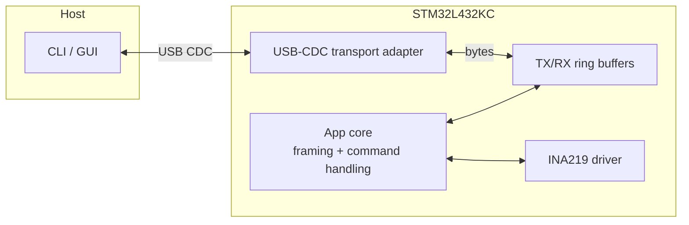
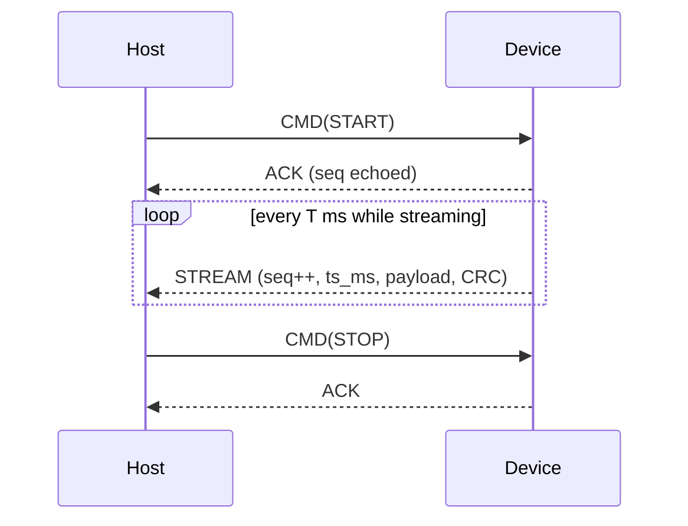

# Architecture

## Overview

The STM32L4 streams measurements to a PC over **USB-CDC** (virtual COM port).
Each frame carries a **sequence number** and **timestamp** so the host can detect **drops** and **jitter**. The protocol is **binary and transport-agnostic**; USB-CDC is just the current transport.

---

## High-level diagram



* **App core**: builds stream frames, parses commands, runs a periodic tick.
* **Transport adapter**: thin layer over ST USB stack; staged writes, **DTR gating**.
* **Rings**: byte SPSC rings; **TX** is *frame-aware drop-oldest*, **RX** is *drop-newest* (no overwrite).
* **INA219**: I²C measurements (current/voltage); payload format is versioned.

---

## Firmware interfaces (C)

```c
// Timing
uint32_t board_millis(void);

// App
void ps_app_init(void);
void ps_app_tick(void);

// Transport (USB-CDC adapter)
void     comm_usb_cdc_init(void);
void     comm_usb_cdc_set_rx_handler(void (*cb)(const uint8_t*, uint32_t));
bool     comm_usb_cdc_link_ready(void);
uint16_t comm_usb_cdc_best_chunk(void);   // typically 64
int      comm_usb_cdc_try_write(const void* buf, uint16_t len);  // staged, non-blocking

// Protocol helpers
size_t proto_write_frame(uint8_t* out, size_t cap, uint8_t type,
                         const uint8_t* payload, uint16_t len,
                         uint32_t seq, uint32_t ts_ms);
size_t proto_write_stream_frame(uint8_t* out, size_t cap,
                                const uint8_t* payload, uint16_t len,
                                uint32_t seq, uint32_t ts_ms);
size_t proto_parse_frame(const uint8_t* buf, size_t len,
                         proto_hdr_t* hdr_out,
                         const uint8_t** payload, uint16_t* payload_len);
void   proto_apply_commands(const uint8_t* data, size_t len, uint8_t* io_streaming);

// Ring buffer (SPSC)
bool     rb_init(rb_t* r, uint8_t* mem, uint16_t cap_pow2);
uint16_t rb_used(const rb_t* r);
uint16_t rb_free(const rb_t* r);
uint16_t rb_peek_linear(const rb_t* r, const uint8_t** ptr);
uint16_t rb_copy_from_tail(const rb_t* r, void* dst, uint16_t n);
void     rb_pop(rb_t* r, uint16_t n);
uint16_t rb_write_try(rb_t* r, const uint8_t* src, uint16_t len);       // no-overwrite
uint16_t rb_write_overwrite(rb_t* r, const uint8_t* src, uint16_t len); // overwrite-oldest
```

---

## Frames

### Common header (16 bytes, little-endian)

```c
typedef struct __attribute__((packed)) {
    uint16_t magic;   // 0x5AA5
    uint8_t  type;    // STREAM=0, CMD=1, ACK=2, NACK=3
    uint8_t  ver;     // 0
    uint16_t len;     // payload bytes (<= PROTO_MAX_PAYLOAD)
    uint16_t rsv;     // 0
    uint32_t seq;     // stream seq or correlation id for replies
    uint32_t ts_ms;   // board_millis()
} proto_hdr_t;
```

* **CRC**: 16-bit **CCITT-FALSE** appended after header+payload (little-endian on the wire).
* **Typical max frame (fits one 64-byte USB write)**: `16-byte header + ≤46-byte payload + 2-byte CRC`.

### Device → Host (STREAM / ACK / NACK)

* **STREAM (type=0)**: payload is versioned sample data. Current v0: `uint16 I_mA, uint16 V_mV`.
  Host derives `P_mW = I_mA * V_mV / 1000`.
* **ACK/NACK (type=2/3)**: header-only (len=0). `seq` echoes the request id.

### Host → Device (CMD)

* **CMD (type=1)**: payload is exactly one opcode byte.

  * `0x01` = **START**
  * `0x02` = **STOP**

---

## Sequence



---

## Back-pressure & reliability

* **TX ring (device → host)**: *frame-aware drop-oldest*. If the host is slow, entire oldest frames are discarded so new frames keep flowing. Gaps are visible via `seq`.
* **RX ring (host → device)**: *drop-newest*. USB ISR enqueues bytes only if space is available; otherwise the write is rejected. Commands are framed, CRC-checked, and parsed in the main loop.
* **USB link gating**: Frames are sent only when USB is configured, **DTR is asserted**, and the previous transmit completed. Writes use a staging buffer and respect `comm_usb_cdc_best_chunk()`.

---

## Timing

* Period `T` is set in firmware (`PS_STREAM_PERIOD_MS`) for now; command to set period can be added later.
* Timestamps come from `board_millis()`; host can compute inter-arrival jitter and end-to-end latency.

---

## Host behavior (CLI / GUI)

* Reads frames, **resyncs on magic**, validates **CRC16**, and parses the header.
* Computes derived power (`mW`) and displays/plots **I**, **V**, **P**.
* Shows **gap** when `seq` increments by >1, indicating dropped frames on the device.
