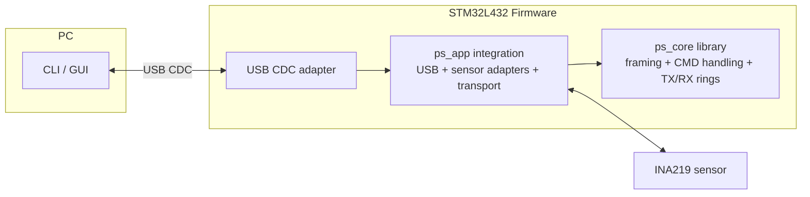
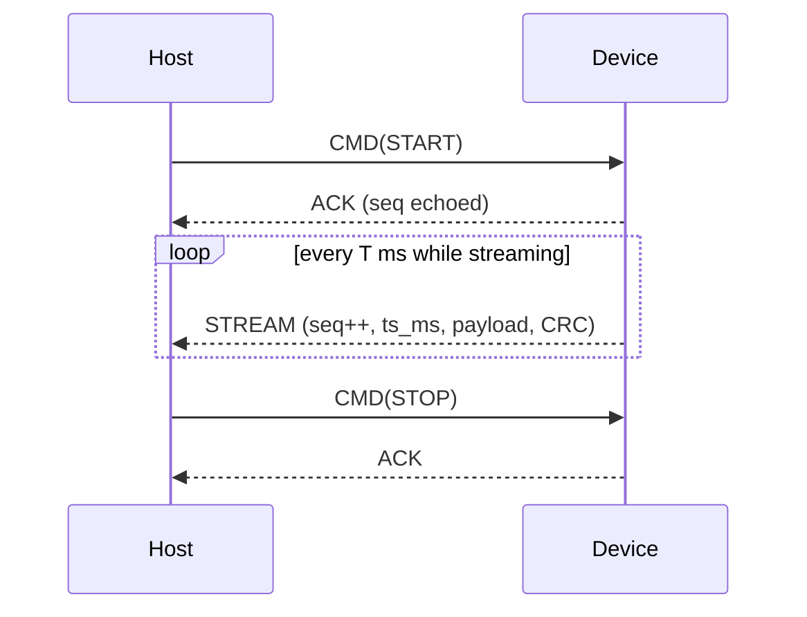

# Architecture

## Overview

The STM32L4 streams measurements to a PC over **USB-CDC** (virtual COM port).
Each frame carries a **sequence number** and **timestamp** so the host can detect **drops** and **jitter**. The protocol is **binary and transport-agnostic**; USB-CDC is just the current transport.

---

## High-level diagram



* **ps_core** → library, fully unit-testable, hardware-agnostic; handles frame creation, parsing, and TX/RX rings.
* **ps_app** → board-specific integration: USB CDC transport, sensor manager, INA219, adapters.
* **USB CDC** → driver-free, cross-platform PC link.
* **INA219** → I²C sensor with current shunt + voltage measurement.

---

## Firmware interfaces (C)

```c
// Timing (board-specific)
uint32_t board_millis(void);

// Application integration (board-specific)
void ps_app_init(void); // Initialize ps_core + USB + sensor adapters
void ps_app_tick(void); // Call periodically in main loop

// Transport adapter (USB-CDC)
void ps_transport_init(ps_transport_adapter_t* t);
void ps_transport_set_rx_handler(ps_transport_adapter_t* t, void (*cb)(const uint8_t*, uint32_t));
bool ps_transport_link_ready(const ps_transport_adapter_t* t);
uint16_t ps_transport_best_chunk(const ps_transport_adapter_t* t);
int ps_transport_write(const ps_transport_adapter_t* t, const void* buf, uint16_t len);

// Protocol helpers (hardware-agnostic)
size_t proto_write_frame(uint8_t* out, size_t cap, uint8_t type,
                         const uint8_t* payload, uint16_t len,
                         uint32_t seq, uint32_t ts_ms);
size_t proto_write_stream_frame(uint8_t* out, size_t cap,
                                const uint8_t* payload, uint16_t len,
                                uint32_t seq, uint32_t ts_ms);
size_t proto_parse_frame(const uint8_t* buf, size_t len,
                         proto_hdr_t* hdr_out,
                         const uint8_t** payload, uint16_t* payload_len);
void   proto_apply_commands(const uint8_t* data, size_t len, uint8_t* io_streaming);

// Ring buffer (SPSC)
bool     rb_init(rb_t* r, uint8_t* mem, uint16_t cap_pow2);
uint16_t rb_used(const rb_t* r);
uint16_t rb_free(const rb_t* r);
uint16_t rb_peek_linear(const rb_t* r, const uint8_t** ptr);
uint16_t rb_copy_from_tail(const rb_t* r, void* dst, uint16_t n);
void     rb_pop(rb_t* r, uint16_t n);
uint16_t rb_write_try(rb_t* r, const uint8_t* src, uint16_t len);       // no-overwrite
uint16_t rb_write_overwrite(rb_t* r, const uint8_t* src, uint16_t len); // overwrite-oldest
```

---

## Frames

### Common header (16 bytes, little-endian)

```c
typedef struct __attribute__((packed)) {
    uint16_t magic;   // 0x5AA5
    uint8_t  type;    // STREAM=0, CMD=1, ACK=2, NACK=3
    uint8_t  ver;     // 0
    uint16_t len;     // payload bytes (<= PROTO_MAX_PAYLOAD)
    uint16_t rsv;     // 0
    uint32_t seq;     // stream seq or correlation id for replies
    uint32_t ts_ms;   // board_millis()
} proto_hdr_t;
```

* **CRC**: 16-bit **CCITT-FALSE** appended after header+payload (little-endian on the wire).
* **Typical max frame**: 16-byte header + ≤46-byte payload + 2-byte CRC (fits one 64-byte USB FS packet).

### Device → Host (STREAM / ACK / NACK)

* **STREAM (type=0)**: versioned sample data; current v0: `uint16 I_uA, int32 V_mV`.
  Host derives `P_mW = I_uA * V_mV /  (1000 * 1000)`.
* **ACK/NACK (type=2/3)**: header-only (len=0). `seq` echoes the request id.

### Host → Device (CMD)

* **CMD (type=1)**: payload is exactly one opcode byte.

  * `0x01` = **START**
  * `0x02` = **STOP**

---

## Sequence



---

## Back-pressure & reliability

* **TX ring (device → host)**: frame-aware, drop-oldest; slow hosts create gaps.
* **RX ring (host → device)**: drop-newest; USB ISR enqueues only if space.
* **USB link gating**: frames sent only when link ready (`DTR` asserted), previous write complete.

---

## Timing

* Stream period `T` set in firmware (`PS_STREAM_PERIOD_MS`).
* `ts_ms` from `board_millis()`; host can compute inter-arrival jitter and latency.

---

## Host behavior (CLI / GUI)

* Resyncs on magic, validates CRC16, parses header.
* Computes derived power (`P_mW`) and displays/plots **I**, **V**, **P**.
* Shows **gap** when sequence increments by >1 (dropped frames).
