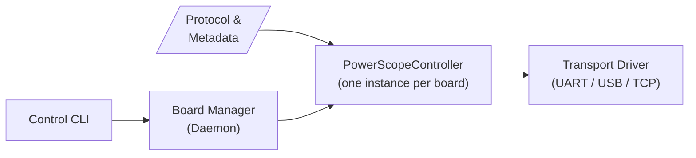
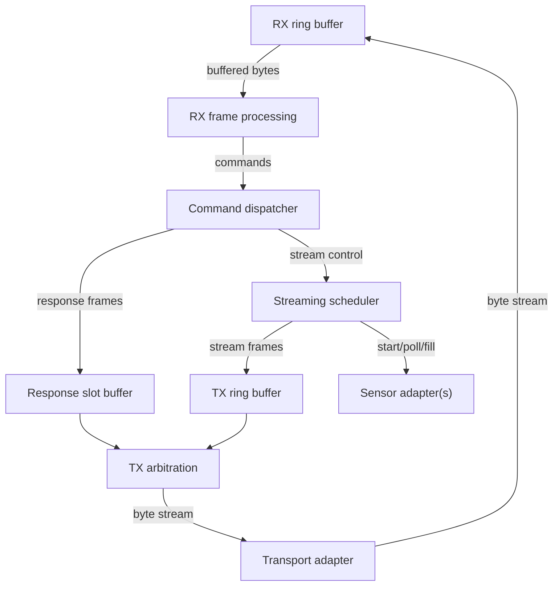
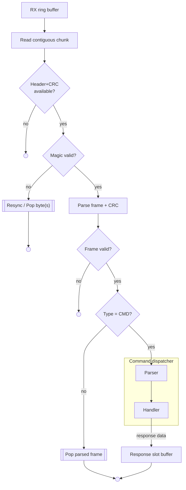
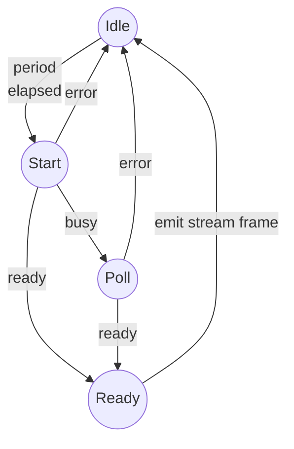
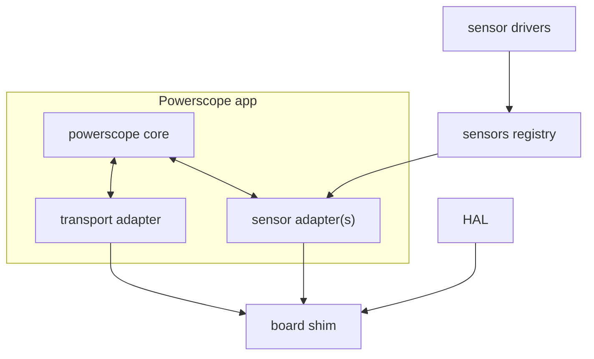
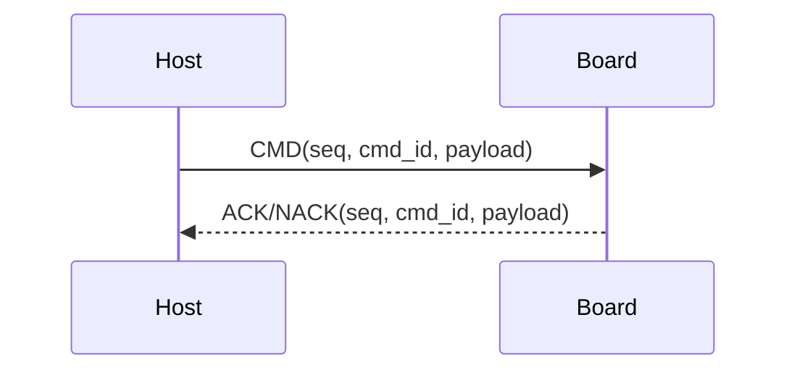
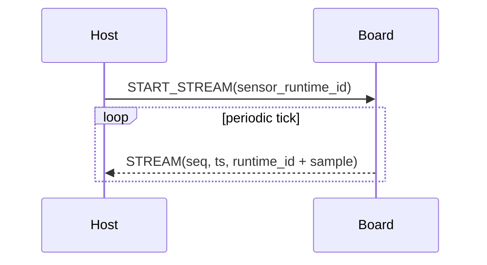

# Architecture

This document is the **authoritative structural view** of Power Scope:
how the host runtime and embedded core are composed, and how they interact.
(High-level overview lives in the README.)

---

## System Context

Power Scope consists of a Python host application and an embedded firmware stack
(portable core + `ps_app` wiring + board shim; STM32 and simulator are targets),
communicating over a shared binary protocol (UART, USB CDC, or TCP) to control
sensors and stream measurement data.

## Document Navigation

Use this file as the high-level architecture entry point, then drill down into subsystem docs:

- Protocol and wire format: `docs/protocol.md`
- Daemon control plane and API: `docs/daemon.md`
- Daemon control CLI (`host.clients.ctl`): `docs/ctl_cli.md`
- Legacy direct CLI (`host.cli`): `docs/legacy_cli.md`
- Test strategy and commands: `docs/testing.md`
- Firmware bring-up/debug details: `docs/firmware-debug.md`, `docs/usb_cdc_setup.md`

## Design Principles

1. Host control plane is owned by the **Daemon** (multi-board aware).
2. Board core contains **no HAL**; hardware is injected via adapters/shim.
3. Wire behavior is defined by `docs/protocol.md`.
4. The board core prioritizes control responses (ACK/NACK) over streaming; streaming is best-effort.

## Host architecture

The host is **daemon-centric**: one daemon process manages multiple boards.
The daemon CLI (`host.clients.ctl`) talks to daemon HTTP API; legacy direct CLI (`host.cli`) can still talk directly to one transport.

```mermaid
flowchart LR
  CLI[Control CLI]
  DAEMON["Board Manager <br> (Daemon)"]
  CTRL["PowerScopeController <br> (one instance per board)"]
  METADATA[/Protocol & <br> Metadata/]
  TRANSPORT["Transport Driver <br>(UART / USB / TCP)"]

  METADATA --> CTRL  
  CLI --> DAEMON --> CTRL --> TRANSPORT

```

**Responsibilities**

* **Board Manager (Daemon)**: multi-board control plane and routing point
* **PowerScopeController**: one controller instance per board; owns that board's protocol/session flow
* **Metadata**: transport and sensor metadata used to configure controller/transport/sensor wiring
* **Protocol**: binary frames and commands
* **Transport Driver**: UART/USB/TCP byte I/O (open/read/write/flush)
* **Control CLI (`host.clients.ctl`)**: operator entrypoint over the daemon HTTP API

---

## `powerscope` C library

The `powerscope` C library is the portable core that implements the
wire protocol, buffering, and sensor streaming logic. It is shared by
all firmware targets and stays independent of any specific MCU, HAL,
or board wiring.

### Library overview

```mermaid
flowchart 
  RXBUF["RX ring buffer"]

  PARSE["RX frame processing"]
  CMDH["Command dispatcher"]
  STREAM["Streaming scheduler"]

  RESPBUF["Response slot buffer"]
  TXBUF["TX ring buffer"]
  TXARB["TX arbitration"]

  TA["Transport adapter"]
  SENSORS["Sensor adapter(s)"]

  TA -->|byte stream| RXBUF
  RXBUF -->|buffered bytes| PARSE
  PARSE -->|commands| CMDH
  CMDH -->|stream control| STREAM
  CMDH -->|response frames| RESPBUF
  STREAM -->|stream frames| TXBUF
  RESPBUF --> TXARB
  TXBUF --> TXARB
  TXARB -->|byte stream| TA
  STREAM -->|start/poll/fill| SENSORS
```

The library overview shows `ps_core` with command handling and streaming scheduler:
- The transport adapter delivers incoming bytes via the registered RX callback (ps_core_on_rx), which enqueues them into the RX ring buffer.
- During `ps_core_tick()`, RX frame processing parses buffered data, validates CRC, and resynchronizes when framing is lost.
- Parsed command frames flow into the command dispatcher, which looks up the parser/handler pair; the handlers then update runtime behavior (for example stream control) and emit response frames.
- The streaming scheduler drives sensor adapters through `start/poll/fill` and produces stream frames.
- On TX, response frames go to the response slot buffer and stream frames go to the TX ring buffer; `ps_tx` arbitrates and writes bytes to the transport adapter.

### Command handling

Command handling covers the round trip from buffered input bytes to queued
response bytes.

One `ps_core_tick()` pass reads a chunk from the RX ring, checks frame sync and CRC, and either dispatches a CMD frame or resyncs.

The diagram shows one `ps_core_tick()` pass reading one contiguous buffered chunk. The dispatcher
input is the parsed frame view (`hdr` + payload slice), not a typed command
struct. The dispatcher selects the parser/handler pair, the handler updates
runtime state or stream control, and response data is written to the response
slot buffer.

```mermaid
flowchart TB
  RXBUF[RX ring buffer] --> CHUNK[Read contiguous chunk]
  CHUNK --> HAVE{Header+CRC <br>  available?}
  HAVE -->|no| END1(( ))
  HAVE -->|yes| MAGIC{Magic valid?}
  MAGIC -->|no| POP1[["Resync / Pop byte(s)"]]
  POP1 --> END2(( ))
  MAGIC -->|yes| PARSE[Parse frame + CRC]
  PARSE --> OK{Frame valid?}
  OK -->|no| END3(( ))
  OK -->|yes| TYPE{Type = CMD?}
  TYPE -->|no| POPF[[Pop parsed frame]]
  POPF --> END4(( ))
  subgraph DISP_FLOW[Command dispatcher]
    PARSER[Parser]
    HND[Handler]
    PARSER --> HND
  end
  TYPE -->|yes| PARSER
  HND -->|response data| RESPBUF[Response slot buffer]
  RESPBUF --> END4
```

### Sensor streaming state machine

Per sensor, streaming is managed by a state machine driven by `ps_core_tick()`.
Stream control and configuration are applied through command handling
(for example start/stop and period changes), and this state machine executes
the runtime sampling loop.

```mermaid
flowchart
  IDLE((Idle)) -->|period <br> elapsed| START((Start))
  START -->|ready| READY((Ready))
  START -->|busy| POLL((Poll))
  START -->|error| IDLE
  POLL -->|ready| READY
  POLL -->|error| IDLE
  READY -->|emit stream frame| IDLE
```

---

## Embedded firmware architecture

The firmware target is **wiring-centric**: `ps_app` wires core, adapters, and board services.

```mermaid
flowchart TB
  subgraph APP[Powerscope app]
    CORE[powerscope core]
    TA[transport adapter]
    SA["sensor adapter(s)"]
    CORE <--> TA
    CORE <--> SA
  end

  SHIM[board shim]
  HAL[HAL]
  REG[sensors registry]
  DRIVERS[sensor drivers]

  TA --> SHIM
  SA --> SHIM
  HAL --> SHIM
  DRIVERS --> REG
  REG --> SA
```

**Responsibilities**

* **ps_app**: firmware-specific wiring layer (located in `firmware/*/`; owns core, transport adapter, sensor adapters, and configures buffers/handlers/instances), then calls `ps_core_tick()`
* **ps_core**:
  * RX: byte-stream resync on `MAGIC`, parse/CRC validate frames, dispatch commands
  * Streaming: per-sensor state machines scheduled from `ps_core_tick()`
  * TX: arbitration + backpressure via `ps_tx` (responses prioritized)
* **Transport Adapter**: core-facing transport interface (`rx_cb`, `tx_write`, link readiness); uses the board shim / HAL underneath
* **Sensor Adapter(s)**: core-facing uniform sensor interface (`start/poll/fill`, `sample_size`, `type_id`); uses the board shim / HAL underneath
* **Sensor registry (`firmware/*/sensors`)**: maps sensor type IDs to adapter factories
* **board shim**: `board_*` layer for timebase, transport init, I²C, and GPIO/LED hooks used by the adapter implementations
* **HAL / OS drivers**: platform-native low-level APIs consumed by shim/transport code
* **Target variants**: both `firmware/stm32l432_nucleo/` and `firmware/sim/` keep the same core contracts (`ps_app` + adapters + shim), so behavior stays protocol-compatible across hardware and simulation

---

## Logical interactions (host ↔ board)

The boundary between host and board is the **wire protocol** over a **byte transport**.

### Command / response (host-driven)

```mermaid
sequenceDiagram
  participant Host as Host
  participant Board as Board

  Host->>Board: CMD(seq, cmd_id, payload)
  Board-->>Host: ACK/NACK(seq, cmd_id, payload)
```

Notes:

* Requests are **sequence-numbered** and matched to ACK/NACK.
* Board responses use a **priority slot** so control remains responsive during streaming.

### Streaming (board-driven)

```mermaid
sequenceDiagram
  participant Host as Host
  participant Board as Board

  Host->>Board: START_STREAM(sensor_runtime_id)
  loop periodic tick
    Board-->>Host: STREAM(seq, ts, runtime_id + sample)
  end
```

Note:

* Streaming is **push-based** (no host polling) and operates independently of command/response traffic.

---

## Extension points

### Add a sensor

* **Drivers**: add the sensor driver under `drivers/<sensor>/` and define its type ID in `drivers/defs.h`
* **Board firmware**: add the adapter wiring under `firmware/*/sensors/<sensor>/`, register it in `firmware/*/src/sensors/registry.c`, and wire instances in `firmware/*/src/ps_app.c`
* **Host metadata**: add sensor metadata and payload/channel mapping in `host/metadata/sensors.yml`

### Add a transport

* **Board**: implement a transport adapter in the target firmware and bind it through the Board shim
* **Host**: add a transport driver in `host/transport/` and metadata entry in `host/metadata/transports.yml`, then wire it into the host app transport factory/registry

### Port to a new MCU

* Create a new board target under `firmware/<target>/` with its own `CMakeLists.txt`, `ps_app.c`, `include/`, `src/`, and Board shim
* Follow the existing board example implementations for the folder layout and wiring pattern
* Provide the board-side services the core needs (timebase, transport, peripheral access like I²C)
* Keep `ps_core` unchanged; reuse the same sensor and transport wiring pattern

---
